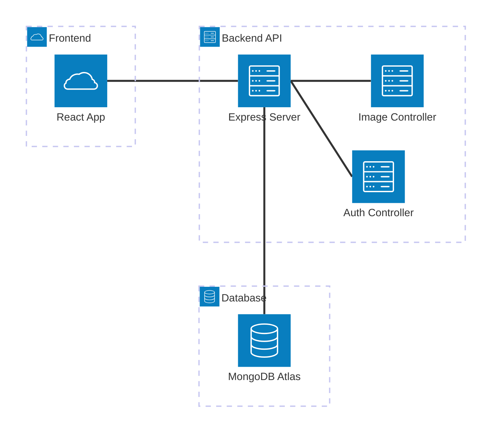

<!-- [MermaidChart: 451700d0-68f9-4036-ab70-ff0a66fae7f8] -->

```mermaid
architecture-beta
    group backend(server)[Backend API]
    group frontend(cloud)[Frontend]
    group db(database)[Database]

    service express(server)[Express Server] in backend
    service auth(server)[Auth Controller] in backend
    service image(server)[Image Controller] in backend
    service react(cloud)[React App] in frontend
    service mongo(database)[MongoDB Atlas] in db

    react:R -- L:express
    express:R -- L:auth
    express:R -- L:image
    express:B -- T:mongo
```
